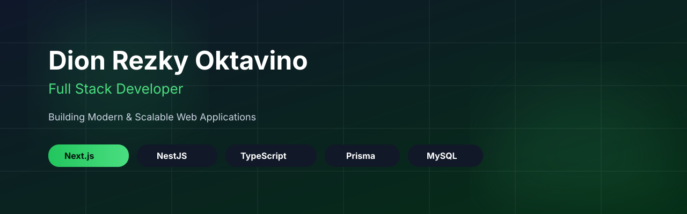

<p align="center">



</p>
<div align="center">

# 👋 Hi, I'm Dion Rezky Oktavino

### Full Stack Developer • Software Engineering Student • 🇮🇩 Indonesia

Building modern web applications with clean architecture, scalable backend systems, and intuitive user experiences.

<p>
  <a href="YOUR_PORTFOLIO">
    
  </a>
  <a href="YOUR_LINKEDIN">
    
  </a>
  <a href="mailto:YOUR_EMAIL">
    
  </a>
</p>


</div>

---

## 🚀 About Me

```ts
const dion = {
  role: "Full Stack Developer",
  location: "Indonesia",
  education: "Software Engineering Student",

  frontend: [
    "Next.js",
    "React",
    "JavaScript",
    "TypeScript",
    "Tailwind CSS"
  ],

  backend: [
    "Node.js",
    "Express.js",
    "NestJS"
  ],

  database: [
    "MySQL",
    "Prisma ORM"
  ],

  tools: [
    "Git",
    "GitHub",
    "VS Code",
    "Postman",
    "Figma"
  ],

  currentlyLearning: [
    "System Design",
    "Backend Architecture",
    "Cloud Deployment"
  ]
}
```

I enjoy transforming ideas into real digital products with clean code, responsive interfaces, and scalable backend systems.

---

# 🛠 Tech Stack

### Frontend

<p>


</p>

### Backend

<p>


</p>

### Database

<p>


</p>

### Tools

<p>


</p>

---

# 🌱 Current Focus

- 🚀 Building production-ready full stack applications
- 🏗 Learning scalable backend architecture
- ☁️ Exploring cloud deployment & VPS
- 📖 Improving software engineering best practices
- 🤝 Contributing to open source in the future

---

# 📦 Featured Projects

## 🍈 Melon Commerce

Modern e-commerce platform for melon sales with responsive UI, interactive shopping experience, and clean dashboard design.

**Tech Stack**

Next.js • Tailwind CSS • Prisma • MySQL

---

## 🎟 Ventix

Modern event ticket booking platform designed for concerts, seminars, workshops, webinars, and community events.

**Tech Stack**

Next.js • Tailwind CSS • NestJS • MySQL

---

## 📝 Notes App

Responsive Notes Application consuming REST API with reusable Web Components.

---

## 📚 Bookshelf API

RESTful API built with Node.js for managing digital book collections.

---

# 📊 GitHub Analytics

<p align="center">


</p>

---

<p align="center">


</p>

---

# 📈 Contribution Graph

<p align="center">


</p>

---

# 🏆 GitHub Trophy

<p align="center">


</p>

---

# 🎯 Goals

- Build meaningful software that solves real-world problems.
- Continuously improve as a Full Stack Developer.
- Learn modern software architecture and cloud technologies.
- Collaborate on impactful projects.

---

<div align="center">

### 💡 "Great software is built one commit at a time."

⭐ Thanks for visiting my profile!

<p align="center">

</p>

</div>