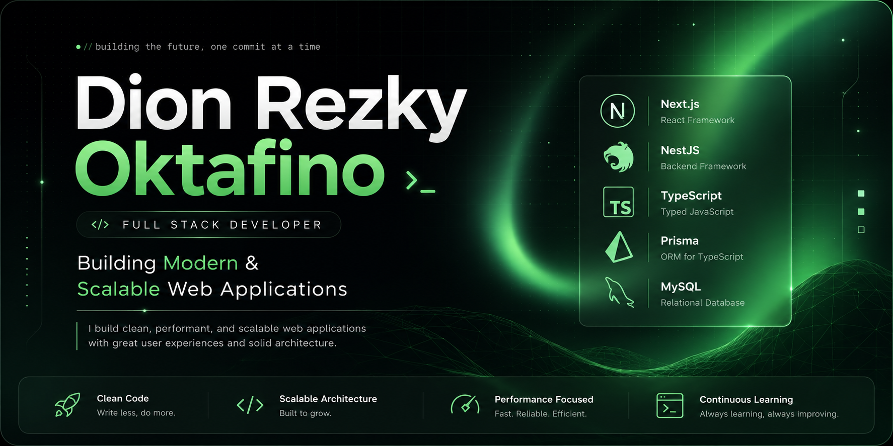

<p align="center">
  
</p>

<h1 align="center">
Hi 👋 I'm Dion Rezky Oktavino
</h1>

<h3 align="center">

Full Stack Developer • Software Engineering Student • Indonesia 🇮🇩

<p align="center">

Building modern web applications with scalable backend architecture and beautiful user experiences.

</p>

</h3>


<p align="center">

<a href="YOUR_PORTFOLIO">

</a>

<a href="YOUR_LINKEDIN">

</a>

<a href="mailto:YOUR_EMAIL">

</a>

</p>

<p align="center">


</p>

---

# 👨🏻‍💻 About Me

```typescript
const dion = {

name: "Dion Rezky Oktavino",

role: "Full Stack Developer",

location: "Indonesia",

frontend: [
"Next.js",
"React",
"TypeScript",
"Tailwind CSS"
],

backend: [
"NestJS",
"Express",
"Node.js"
],

database: [
"MySQL",
"Prisma"
],

tools: [
"Git",
"GitHub",
"Postman",
"VS Code",
"Figma"
],

currentlyLearning: [
"System Design",
"Cloud Deployment",
"Software Architecture"
]

}
```

---

# ⚡ Tech Stack

## Frontend

<p>


</p>

## Backend

<p>


</p>

## Database

<p>


</p>

## Tools

<p>


</p>

---

# 🚀 Featured Projects

### 🍈 Melon Commerce

Modern Agriculture Marketplace

> Next.js • Prisma • MySQL

---

### 🎟 Ventix

Modern Event Ticket Platform

> Next.js • Tailwind • NestJS

---

### 📚 Bookshelf API

REST API

---

### 📝 Notes App

REST API Consumer

---

# 📊 GitHub Analytics

<p align="center">


</p>

<p align="center">


</p>

---

# 📈 Activity Graph

<p align="center">


</p>

---

# 🏆 GitHub Trophy

<p align="center">


</p>

---

<div align="center">

### ⭐ Building software with passion, consistency, and continuous learning.

## 🐍 Contribution Snake

<p align="center">
  
</p>

</div>